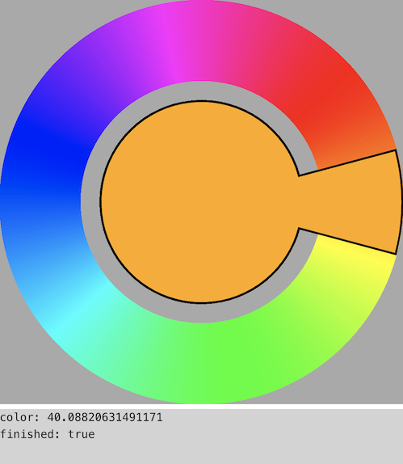

Simple rotateable colorwheel returning hue value from `0..360`. 

## Usage

```html
<script src="jquery-3.3.1.js"></script>
<script src="rotateableColorpicker.jquery.js"></script>
```

```javascript
$('.colorpicker').colorwheel({
    /* Defaults:
    rotatable: true,
    magnifyingArc: 15 * Math.PI/180, // 0 hides it
    wheelThickness: 0.4,
    emitEvents: true
    */
}).on('colorChange', function(e, color, finished) {
    $('#debug').text('color: '+color+'\nfinished: '+finished);
});
```

## Screenshot

